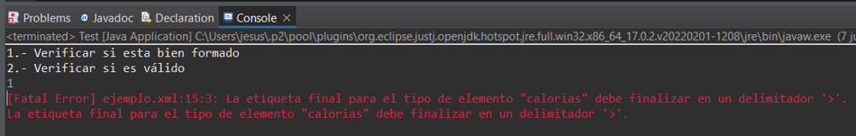

# Pryecto XML 

Proyecto de XML para la materia de Temas Selectos de Bases de Datos 

- **Estudiante:** Valenzuela Rivas Jesús Ramiro
- **Profesor:** Dr. Clemente García Gerardo

## Archivo DTD (Document Type Definition) 
Es un archivo en el que se define los tipos de elementos, atributos y entidades permitidos en un archivo comúnmente llamado XML, además, puede expresar limitaciones para combinarlos.

### Definir una serie de etiquetas con restricciones

- recetas
- receta
- nombre
- tipo
- ingredientes
- ingrediente
- calorias
- pasos
- paso
- dificultad
- tiempo
- elaboracion
  
### Mostrar Archivo DTD

```
<!ELEMENT recetas (receta)+>
<!ELEMENT receta (nombre, tipo, ingredientes, calorias, pasos, dificultad, tiempo, elaboracion)>

<!ELEMENT nombre (#PCDATA)>

<!ELEMENT tipo EMPTY>
<!ATTLIST tipo definicion (entrante | primero | segundo | postre) #REQUIRED>

<!ELEMENT ingredientes (ingrediente+)>
<!ELEMENT ingrediente EMPTY>
<!ATTLIST ingrediente nombre CDATA #REQUIRED>
<!ATTLIST ingrediente cantidad CDATA #REQUIRED>

<!ELEMENT calorias (#PCDATA)>

<!ELEMENT pasos (paso+)>
<!ELEMENT paso (#PCDATA)>
<!ATTLIST paso orden CDATA #REQUIRED> 

<!ELEMENT dificultad (#PCDATA)>

<!ELEMENT tiempo (#PCDATA)>

<!ELEMENT elaboracion (#PCDATA)>
System.out.println();
```
### Formacion del documento DTD
- **recetas:** etiqueta que contiene una o mas etiquetas receta
- **receta:** contiene etiqueta nombre, ingredientes, calorias, pasos, dificultad, tiempo y elaboracion.
- **nombre:** puede contener texto
- **tipo:** etiqueta vacía con un atributo llamado definición
- **ingredientes:** contiene uno o muchas etiquetas de tipo ingrediente: contiene un atributo llamado nombre y otro llamado cantidad, ambos requeridos.
- **calorias:** puede o no contener texto.
- **pasos:** se conforma de uno o más etiquetas de tipo paso.
- **paso:** puede o no contener texto, además tiene un atributo llamado orden requerido.
- **dificultad:** puede o no contener texto.
- **tiempo:** puede o no contener texto.
- **elaboracion:** puede o no contener texto

## Validar documento XML
XML es un meta-lenguaje que permite definir lenguajes de marcado adecuados a usos determinados.
Fue concebido para describir información. Su función principal es la de ayudarnos a organizar contenidos.

### Mostrar el archivo XML
```{XML}
<?xml version="1.0"?>
<!DOCTYPE recetas SYSTEM "ejemplo.dtd">
<recetas>
	<receta>
		<nombre>Pastel de chocolate</nombre>
		<tipo definicion="postre"/>
		<ingredientes>
			<ingrediente nombre="Chocolate en polvo" cantidad="250 gramos"/>
			<ingrediente nombre="mantequilla" cantidad="200 gramos"/>
			<ingrediente nombre="harina" cantidad="1 vaso"/>
			<ingrediente nombre="azúcar" cantidad="1 vaso"/>
			<ingrediente nombre="huevos" cantidad="3"/>
		</ingredientes>
		<calorias>600</calorias>
		<pasos>
			<paso orden="1">Mezclar el chocolate con la mantequilla.</paso>
			<paso orden="2">Separar las yemas y mezclarlas con el azúcar.</paso>
			<paso orden="3">Unir ambas mezclas y añadir la harina.</paso>
			<paso orden="4">Montar las claras y añadirlas a la mezcla anterior mezclando siempre de arriba hacia abajo para que no se bajen las claras.</paso>
			<paso orden="5">Untar un molde de mantequilla y espolvorear de harina.</paso>
			<paso orden="6">Precalentar el horno y hornear a 175º durante unos 40 min.</paso>
		</pasos>
		<dificultad>Fácil</dificultad>
		<tiempo>45 minutos</tiempo>
		<elaboracion>Horno</elaboracion>
	</receta>
	<receta>
		<nombre>Tiramisú</nombre>
		<tipo definicion="postre"/>
		<ingredientes>
			<ingrediente nombre="cobertura Valor" cantidad="100 gramos"/>
			<ingrediente nombre="bizcochos blandos" cantidad="24"/>
			<ingrediente nombre="azúcar" cantidad="0.5 vasos"/>
			<ingrediente nombre="café solo" cantidad="1 tazón"/>
			<ingrediente nombre="huevos" cantidad="3"/>
			<ingrediente nombre="licor" cantidad="1 chorrito"/>
			<ingrediente nombre="nata líquida" cantidad="0.3 litros"/>
			<ingrediente nombre="queso mascarpone" cantidad="250 gramos"/>
		</ingredientes>
		<calorias>450</calorias>
		<pasos>
			<paso orden="1"> Echar la mitad del azúcar en la nata liquida y montarla hasta que quede muy compacta.</paso>
			<paso orden="2">Separar las claras de las yemas y montarlas a punto de nieve.</paso>
			<paso orden="3">Mezclar despacio el queso y las yemas de huevo, añadiendo el resto del azúcar.</paso>
			<paso orden="4">Cuando el queso y las yemas estén mezclados juntar con la nata montada y las claras a punto de nieve y mezclar todo bien, pero despacio.</paso>
			<paso orden="5">En el café caliente disolver un tercio del chocolate y echar un chorrito de licor.</paso>
			<paso orden="6">Mojar muy ligeramente los bizcochos en el café sin dejar que se empapen y disponer la mitad de ellos cubriendo el fondo de una fuente.</paso>
			<paso orden="7">Echar la mitad de la mezcla sobre los bizcochos cubriéndolos uniformemente.</paso>
			<paso orden="8">Poner una nueva capa de bizcochos mojados sobre la mezcla.</paso>
			<paso orden="9">Echar el resto de la mezcla sobre la segunda capa de bizcochos.</paso>
			<paso orden="10">Dejar reposar al menos 6 horas antes de servir.</paso>
		</pasos>
		<dificultad>Media</dificultad>
		<tiempo>7 horas</tiempo>
		<elaboracion>Microondas</elaboracion>
	</receta>
</recetas>
```
## Validar documento XML
### Bien formado (no checa restricciones de XML)
#### Código
```
	public static void bienFormado(String archivo) {
		try {
			File archivoXML = new File(archivo);
			DocumentBuilderFactory dbFactory = DocumentBuilderFactory.newInstance();
			DocumentBuilder builder = dbFactory.newDocumentBuilder();
			Document documentoXML = builder.parse(archivoXML);
			
			System.out.println("El archivo esta bien formado");
		}catch(Exception e) {
			System.err.println("Ha ocurido un error.");
		}
		
	}
```
#### Resultados
- **Se borró el cierre de una etiqueta para mostrar un documento que no esta bien formado.**

- **Se corrigió el error de la llave pero se agregó una nueva etiqueta en el archivo dtd, el archivo a pesar de no cumplir con dtd, sigue estando bien formado.**


### Válido (hace uso del DTD para checar las restricciones)
#### Código
```
	public static void esValido(String archivo) {
		try {
			File archivoXML = new File(archivo);
			DocumentBuilderFactory dbFactory = DocumentBuilderFactory.newInstance();
			dbFactory.setValidating(true);
			DocumentBuilder builder = dbFactory.newDocumentBuilder();
			Document documentoXML = builder.parse(archivoXML);
			System.out.println("Archivo analizado.");
		}catch(Exception e) {
			System.err.println("Ha ocurido un error.");
		}
	}
```
#### Resultados
- **Se quitó el indicador de frecuencia en el archivo dtd de la etiqueta receta (antes +)**

- **Se agregó de nuevo el indicador de frecuencia**


## Mostrar contenido del documento XML
### Código
```
	public static void datosDocumento(String archivo) {
		try {
			File archivoXML = new File(archivo);
			DocumentBuilderFactory dbFactory = DocumentBuilderFactory.newInstance();
			dbFactory.setValidating(true);
			DocumentBuilder builder = dbFactory.newDocumentBuilder();
			Document documentoXML = builder.parse(archivoXML);
			
			documentoXML.getDocumentElement().normalize();
						
			System.out.println("Elemento raiz: " + documentoXML.getDocumentElement().getNodeName());
			
			NodeList nodos = documentoXML.getElementsByTagName("receta");

			System.out.println("Contenido: \n");
			
			for(int i = 0; i < nodos.getLength(); i++) {
				Node nodo = nodos.item(i);
				String elemento = nodo.getNodeName();
				System.out.println("Elemento actual: " + elemento);
				
				if(nodo.getNodeType() == Node.ELEMENT_NODE) {
					Element element = (Element) nodo;
					
					System.out.println("Nombre: " + element.getElementsByTagName("nombre").item(0).getTextContent());
					Element tipo = (Element)(element.getElementsByTagName("tipo").item(0));
					System.out.println("Tipo: " + tipo.getAttribute("definicion"));
					
					Node ingred = element.getElementsByTagName("ingredientes").item(0);
					NodeList ingredientes = ingred.getChildNodes();
					
					int iC = 0;
					System.out.println("--------" + element.getElementsByTagName("ingredientes").item(0).getNodeName() + "--------");
					for(int j = 0; j < ingredientes.getLength(); j++) {
						Node aux = ingredientes.item(j);
						
						if(aux.getNodeType() == Node.ELEMENT_NODE) {
							Element ingredEle = (Element)(ingredientes);
							Element ing = (Element)(ingredEle.getElementsByTagName("ingrediente").item(iC));
							System.out.println(ing.getAttribute("nombre") + " " + ing.getAttribute("cantidad"));
							iC++;
						}						
					}
					
					System.out.println("---------------------------");
					
					System.out.println("Calorías: " + element.getElementsByTagName("calorias").item(0).getTextContent());
					
					Node pasosNod = element.getElementsByTagName("pasos").item(0);
					NodeList pasos = pasosNod.getChildNodes();
					System.out.println("--------" + element.getElementsByTagName("pasos").item(0).getNodeName() + "--------");
					iC = 0;
					for(int j = 0; j < pasos.getLength(); j++) {
						Node aux = pasos.item(j);
						
						if(aux.getNodeType() == Node.ELEMENT_NODE) {
							Element pasosEle = (Element)(pasos);
							Element pas = (Element)(pasosEle.getElementsByTagName("paso").item(iC));
							System.out.println("Paso " + pas.getAttribute("orden") + ": " + pas.getTextContent());
							iC++;
						}						
					}
					System.out.println("---------------------");
					System.out.println("Dificultad: " + element.getElementsByTagName("dificultad").item(0).getTextContent());
					System.out.println("Tiempo: " + element.getElementsByTagName("tiempo").item(0).getTextContent());
					System.out.println("Elaboración: " + element.getElementsByTagName("elaboracion").item(0).getTextContent());
				}
				System.out.println();
			}
			
			
		}catch(Exception e) {
			System.err.println(e.getMessage());
		}
	}
```
### Mostrar los datos del documento XML
